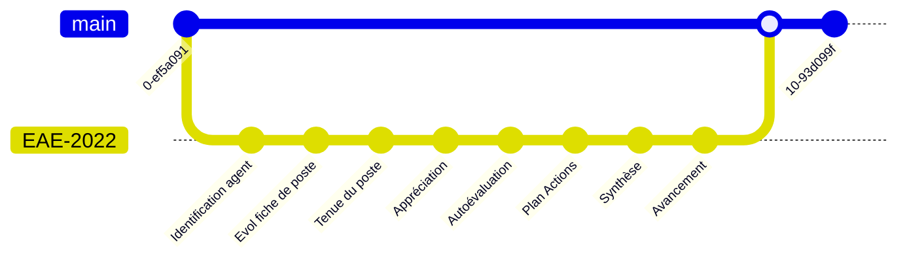

# 🤓 template-eae

Une repo template dédiée aux EAEs sur [monportailrh.nc](https://www.monportailrh.nc/) et mener
la préparation de ce moment avec des outils de développeurs ouvrant de nouvelles
perspectives autour de la collaboration.

# 🤓 Des EAEs sur `git` 🙀

Parce que...



# ❔ Évaluation et avancement

Cf le [site officiel de la DRHFPNC](https://drhfpnc.gouv.nc/carriere-des-fonctionnaires/evaluation-et-avancement) : 

_Chaque année, tous les agents permanents (titulaires et non titulaires) participent
à un entretien annuel d'évaluation conduit par leur responsable hiérarchique direct._

_En application de l’article 41 de l’arrêté n° 1065 du 22 août 1953 portant statut général
des fonctionnaires des cadres territoriaux, il doit être procédé à l’évaluation de la valeur
professionnelle de chaque fonctionnaire par l’attribution d’une cote numérique suivie d’une
appréciation générale._

Cette repo a pour vocation à aider à la saisie des données dans le formulaire via une collaboration sur `git`
et a pour ambition d'aider au processus d'élaboration de l'EAE avec le collaborateur ou pour vous-même.

# 🥇 Bénéfices attendus

- Versionner totalement vos saisies
- Possible de visualiser les différences au cours des années
- Possible de releaser (finalisation de l'EAE)
- Possible de faire des issues et donc d'embarquer cela dans le suivi avec des outils de collaboration

# 👇 Cas d'utilisation

1. Cliquer sur `Use this template`
2. Choisir l'owner cible (votre compte personnel par exemple)
3. Cocher `Privé` (vous pourrez donner des droits très fins par la suite à votre manager par exemple)
4. Choisir un nom pour la repo eg. `my-EAE`
5. Mettre éventuellement une description


Sinon, plus de détails, aller sur la documentation qui détaille le processus de [création de repo GH à partir d'un template](https://docs.github.com/en/repositories/creating-and-managing-repositories/creating-a-repository-from-a-template).


# 🔖 Liens utiles

- [Site institutionnel DRHFPNC](https://drhfpnc.gouv.nc/)
- [Évaluation et avancement](https://drhfpnc.gouv.nc/carriere-des-fonctionnaires/evaluation-et-avancement)
- [Documents et liens utiles pour l'EAE](https://drhfpnc.gouv.nc/formulaires-agents/entretien-annuel-dechange)
- [Fiches métier](https://drhfpnc.gouv.nc/travailler-dans-la-fonction-publique-trouver-un-emploi-repertoire-des-emplois/les-fiches-emploi)

# 💡 Possibilités ouvertes

- Via la CI, compiler l'EAE via [`pandoc`](https://pandoc.org/)
- Suivre et planifier les EAEs via l'activité des modifications et suivre sur un projet GH
- Production de métriques sur un EAE
- Automatisation/notifications par outils cloud et webhooks (push d'un draft, notif de changement via mail ou Teams,...)

# 📖 Compiler en ePub/pdf/html/docx

## ✔️ Prérequis

Afin de compiler les documents, vous devez installer [`pandoc`](https://pandoc.org/) : 

```bash
brew install pandoc
```

Pour le moteur PDF (lualatex ou xelatex) :
```bash
sudo apt-get install texlive-full
```

## 💪 Builder avec `task`

👉 Un `Taskfile.yml` a été préparé pour simplifier le build des documents (`html`, `ePub`, `pdf`, `docx`).
Les fichiers générés se trouvent dans le répertoire `dist/`.

Installation de [go-task](https://taskfile.dev/installation/) :
```bash
brew install go-task
```

Tous les détails :

```bash
task --list
```

## 🚀 Générer tous les formats

```bash
task
```

Ou un format spécifique :

```bash
task html
task epub
task pdf
task docx
```

## 📖 Lire avec Calibre

Pour lire le ePub (et le transférer sur une liseuse,...) [Calibre](https://calibre-ebook.com/) est une solution très efficace. 

#### 🐧 Linux 

```bash
sudo -v && wget -nv -O- https://download.calibre-ebook.com/linux-installer.sh | sudo sh /dev/stdin
```

#### 🪟 Windows 

```bash
choco install calibre
```

#### 🍎 Autres 

Pour le reste (MacOS, portable, Android, iOS,... ), aller sur la [page de téléchargement](https://calibre-ebook.com/download).


## 🚀 Speedrun script

Script pour :

1. Instancier la repo
2. Cloner
3. Builder les documents

Tout simplement :

```bash
gh repo create my-eae --description "Repo de mon EAE" --private --template opt-nc/template-eae
gh repo clone my-eae
cd my-eae
task
```

## 🪛 Troubleshootings

Lors de la génération de l'epub, il est possible d'avoir l'erreur suivante :
```shell
 ssh: handshake failed: knownhosts: key mismatch
```
Il suffit d'ajouter **github.com** au fichier **known_hosts**. Si l'entrée github.com est déjà présente, c'est qu'il faut la mettre à jour

Voici quelques commandes utiles :

- Scan known hosts

```shell
ssh-keygen -H -F github.com
```

- Remove entry for host

```shell
ssh-keygen -R github.com
rm ~/.ssh/known_hosts.old (à exécuter après validation)
```

- Add entry for host

```shell
ssh-keyscan -H github.com > ~/.ssh/known_hosts
```
